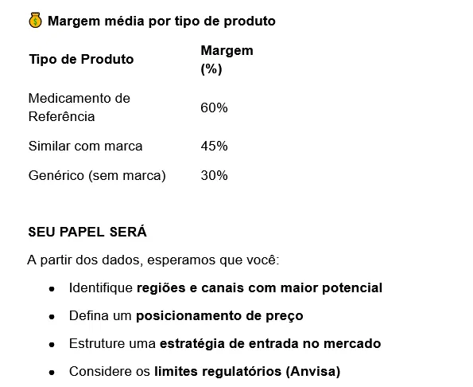
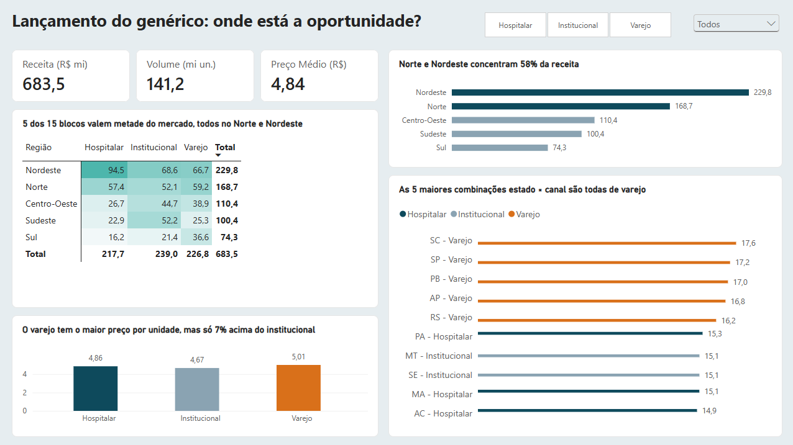
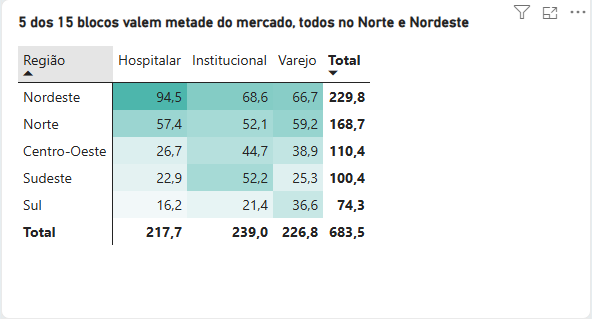
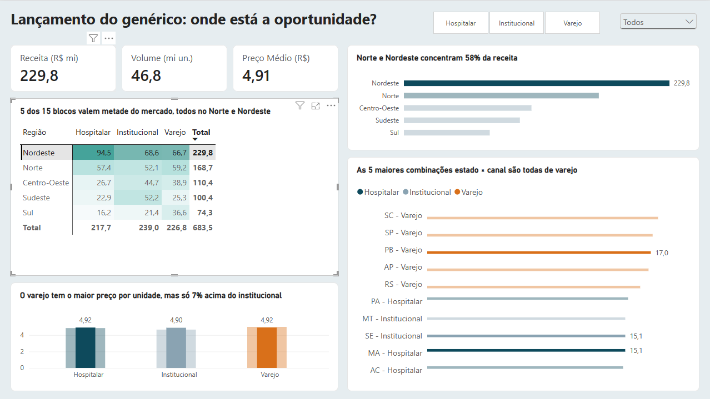
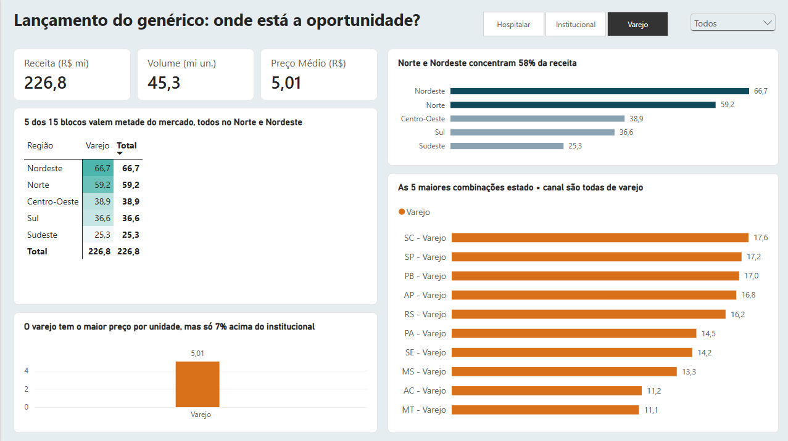
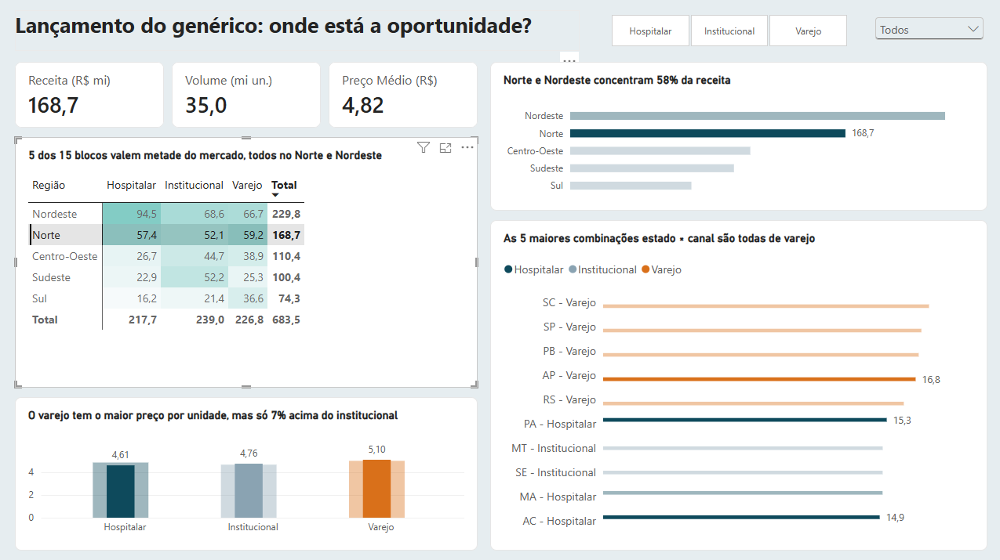
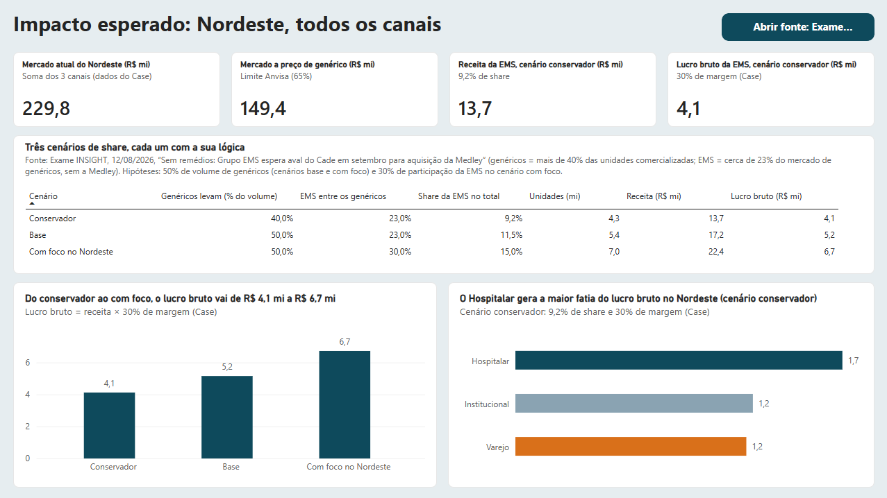
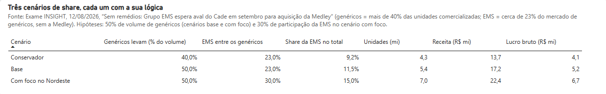
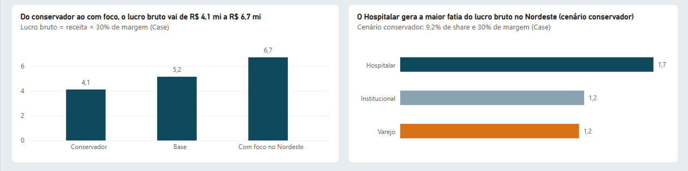

# Lançamento de um genérico: onde investir e quanto ganhar

Análise de um case de negócios sobre o lançamento da versão genérica de um medicamento anti-hipertensivo cuja patente está expirando. O projeto responde aos quatro pontos do papel esperado no case: quais **regiões e canais** têm maior potencial, qual **posicionamento de preço** adotar, como estruturar a **estratégia de entrada** e quais **limites regulatórios (Anvisa)** considerar. O resultado é um dashboard em Power BI com duas páginas, mais esta documentação.

> **Resumo**
>
> - **Onde:** Nordeste primeiro, nos três canais, na ordem do tamanho do bloco: Hospitalar (R$ 94,5 mi), Institucional (R$ 68,6 mi) e Varejo (R$ 66,7 mi). Norte × Varejo (R$ 59,2 mi) é o passo seguinte.
> - **Preço:** no teto regulatório. O genérico precisa custar pelo menos 35% menos que o referência, ou seja, no máximo 65% do preço atual (cerca de R$ 3,15 por unidade).
> - **Margem:** 30% (dado do case) deixa o lucro bruto em torno de R$ 1 por unidade. A ideia é **ganhar no volume**, sem guerra de preço.
> - **Impacto no Nordeste:** de R$ 4,1 mi (cenário conservador, 9,2% de share) a R$ 6,7 mi (cenário com foco, 15% de share) de lucro bruto por ano.

## Sumário

1. [O case](#1-o-case)
2. [Os dados](#2-os-dados)
3. [Diagnóstico: onde estão as oportunidades](#3-diagnóstico-onde-estão-as-oportunidades)
4. [Estratégia de entrada](#4-estratégia-de-entrada)
5. [Posicionamento de preço e margem](#5-posicionamento-de-preço-e-margem)
6. [Market share e lucro estimado](#6-market-share-e-lucro-estimado)
7. [Premissas e limitações](#7-premissas-e-limitações)
8. [Estrutura do repositório](#8-estrutura-do-repositório)
9. [Fontes](#9-fontes)

---

## 1. O case

Um dos medicamentos mais vendidos do país, usado no controle da hipertensão e na prevenção de eventos cardiovasculares, vai perder a patente. Segundo o enunciado, esse produto fatura **mais de R$ 650 milhões por ano** no Brasil, com forte presença no varejo, especialmente nas regiões Sudeste e Norte/Nordeste. A EMS pretende lançar a versão genérica.

O case fornece uma base com unidades vendidas e preço médio por região, estado e canal, e a margem média por tipo de produto:

| Tipo de produto | Margem |
|---|---|
| Medicamento de referência | 60% |
| Similar com marca | 45% |
| Genérico (sem marca) | 30% |

O papel esperado é:

- identificar **regiões e canais com maior potencial**;
- definir um **posicionamento de preço**;
- estruturar uma **estratégia de entrada no mercado**;
- considerar os **limites regulatórios (Anvisa)**.

## 2. Os dados

- **Estrutura:** 75 linhas, que correspondem a 25 UFs × 3 canais (Varejo, Hospitalar e Institucional). Colunas: Região, Estado, Canal, Unidades vendidas (mil) e Preço médio por unidade (R$). Não há datas. A base não inclui Piauí (PI) nem Tocantins (TO).
- **Receita** = unidades × preço médio por unidade.
- **Total da base:** R$ 683,5 mi, 141,2 mi de unidades e preço médio de R$ 4,84. O valor é coerente com os "mais de R$ 650 milhões" do enunciado.
- **Preço médio** é sempre calculado como receita ÷ volume (média ponderada), nunca como média simples da coluna.
- **Tratamento:** o preço foi arredondado a duas casas e foram acrescentadas as colunas *Receita (R$ mil)* e *Estado - Canal* (arquivo `Base_PowerBI_Case.xlsx`).
- **Premissa central:** a base representa as vendas atuais do **medicamento de referência**, e o preço da base é tratado como o preço do referência. Nem a planilha nem o enunciado dizem isso explicitamente; a premissa se apoia no total da base, que bate com o faturamento citado no case, e no fato de que ainda não existe genérico.

## 3. Diagnóstico: onde estão as oportunidades

A página 1 do dashboard ("Oportunidades") mostra três cartões (receita, volume e preço médio), a matriz Região × Canal, a receita por região, as 10 maiores combinações estado × canal e o preço médio por canal. Os filtros de canal e de região atualizam todos os visuais.

### O que os dados mostram

**1. Forte presença no Norte e no Nordeste.** As duas regiões somam R$ 398,5 mi dos R$ 683,5 mi (cerca de 58% da receita) e representam as maiores oportunidades.

| Região | Receita (R$ mi) |
|---|---|
| Nordeste | 229,8 |
| Norte | 168,7 |
| Centro-Oeste | 110,4 |
| Sudeste | 100,4 |
| Sul | 74,3 |

**2. Não há um vencedor claro entre os canais no total.**

| Canal | Receita (R$ mi) | Preço médio (R$/un.) |
|---|---|---|
| Institucional | 239,0 | 4,67 |
| Varejo | 226,8 | 5,01 |
| Hospitalar | 217,7 | 4,86 |

**3. O varejo se destaca em dois pontos:**

- tem o **maior preço médio por unidade** (R$ 5,01, cerca de 7% acima do Institucional, na base). Esse prêmio não aparece em todas as regiões: no Nordeste, Varejo e Hospitalar têm o mesmo preço (R$ 4,92);
- as **cinco maiores combinações estado × canal são de varejo** (SC, SP, PB, AP e RS), duas delas no Norte/Nordeste: PB (R$ 17,0 mi) e AP (R$ 16,8 mi).

**4. Cruzando região e canal, o Nordeste tem os três maiores blocos do país.** O Nordeste é também a maior região em varejo, à frente do Norte.

| Região | Hospitalar | Institucional | Varejo | Total |
|---|---|---|---|---|
| Nordeste | **94,5** | **68,6** | **66,7** | 229,8 |
| Norte | 57,4 | 52,1 | 59,2 | 168,7 |
| Centro-Oeste | 26,7 | 44,7 | 38,9 | 110,4 |
| Sudeste | 22,9 | 52,2 | 25,3 | 100,4 |
| Sul | 16,2 | 21,4 | 36,6 | 74,3 |
| **Total** | 217,7 | 239,0 | 226,8 | 683,5 |

*Receita anual em R$ mi.*

O bloco Nordeste × Hospitalar (R$ 94,5 mi) é o maior do mercado e vale mais de 40% de todo o canal Hospitalar (R$ 217,7 mi).

Ao filtrar o Nordeste, os cartões mostram R$ 229,8 mi e 46,8 mi de unidades, cerca de um terço do mercado:

Ao filtrar o canal Varejo, o gráfico de regiões mostra o Nordeste (66,7) à frente do Norte (59,2):

Ao filtrar o Norte, o gráfico de preço mostra o Varejo como o canal mais caro da região (R$ 5,10, contra R$ 4,76 no Institucional e R$ 4,61 no Hospitalar):

## 4. Estratégia de entrada

**Lançar primeiro no Nordeste, nos três canais, na ordem do tamanho do bloco.**

| Prioridade | Bloco | Receita atual (R$ mi) | Posição entre os 15 blocos | Por quê |
|---|---|---|---|---|
| A | Nordeste × Hospitalar | 94,5 | 1º | Maior bloco do mercado |
| B | Nordeste × Institucional | 68,6 | 2º | Segundo maior bloco |
| C | Nordeste × Varejo | 66,7 | 3º | Quase empatado com o 2º; maior região em varejo; PB - Varejo está no Top 10 |
| Próximo passo | Norte × Varejo | 59,2 | 4º | Segundo maior varejo; no Norte, o varejo é o canal de maior preço; AP - Varejo está no Top 10 |

**Por que não escolher entre B e C?** A diferença entre os dois blocos é de cerca de 3%, e o preço no Nordeste é praticamente o mesmo (R$ 4,90 e R$ 4,92). Os dados não os separam, então a ordem segue o tamanho. Qualquer outro critério é hipótese de negócio. O enunciado também não define o canal Institucional.

### Como ganhar mercado (hipóteses de negócio)

A pergunta é quem decide a compra em cada canal.

- **Varejo:** o farmacêutico pode substituir o medicamento prescrito pelo genérico correspondente, salvo restrição expressa do médico. Ações: treinamento e condições comerciais para redes e distribuidores, estoque garantido nos pontos de maior volume e visita médica.
- **Hospitalar:** decide a compra ou a padronização do hospital. Ações: cadastro nos hospitais, abastecimento garantido e material técnico sobre a equivalência com o referência.
- **Institucional:** depende da definição do canal, que o case não dá. Em geral envolve compras de instituições por processos próprios de negociação.
- **Regra de propaganda:** medicamentos de venda sob prescrição só podem ser anunciados a profissionais habilitados a prescrever ou dispensar. As ações comerciais são, portanto, entre empresas e profissionais, e não campanhas para o consumidor.

## 5. Posicionamento de preço e margem

**A ideia é ganhar no volume.** O genérico tem margem menor que o referência e o preço é limitado por regra. Três contas mostram o efeito:

1. **Teto de preço.** O genérico precisa custar pelo menos 35% menos que o referência. Com o preço médio da base: R$ 4,84 × 65% = **R$ 3,15 por unidade** (R$ 3,19 no Nordeste).
2. **Lucro bruto por unidade.** Genérico: 30% × R$ 3,15 = **R$ 0,94** (R$ 0,96 no Nordeste). Referência: 60% × R$ 4,84 = **R$ 2,90**. O genérico rende cerca de um terço por unidade, então precisa de volume.
3. **Desconto extra.** Supondo que o custo por unidade não muda, cada ponto de desconto além do teto sai direto do lucro (valores do Nordeste):

| Desconto sobre o preço do referência | Preço do genérico | Lucro por unidade | Margem |
|---|---|---|---|
| 35% (teto) | R$ 3,19 | R$ 0,96 | 30% |
| 40% | R$ 2,95 | R$ 0,71 | 24% |
| 45% | R$ 2,70 | R$ 0,47 | 17% |

De 35% para 45% de desconto, o lucro por unidade cai pela metade. Seria preciso vender cerca do dobro para compensar. Esta conta não aparece no dashboard final, onde o gráfico de descontos foi retirado, e é apresentada na fala.

**Posicionamento:** entrar no teto ou perto dele, sem guerra de preço. Como o genérico não tem marca comercial, a diferenciação vem da confiança na EMS, da disponibilidade do produto e do relacionamento com cada canal.

**A margem de 30% é a média do case, não um limite.** O lucro por unidade depende do custo de produção. Com escala, a EMS pode ter custo menor e margem maior, mas o case não traz dados de custo, e os 30% foram usados como premissa de trabalho.

### Limites regulatórios considerados

| Regra | Onde entra na análise |
|---|---|
| O genérico deve custar pelo menos 35% menos que o referência | Teto de preço (R$ 3,15) |
| O genérico não tem marca comercial | Posicionamento: diferenciar por confiança, disponibilidade e relacionamento |
| O genérico pode substituir o referência (intercambialidade, garantida por testes de bioequivalência) | Ações no varejo: o balcão da farmácia é uma porta de entrada |
| Propaganda de medicamento de prescrição só a profissionais | Ações comerciais entre empresas e profissionais |

## 6. Market share e lucro estimado

A página 2 do dashboard ("Impacto") estima o resultado para o **Nordeste, todos os canais**.

### Como o share é construído

**Share (em unidades) = quanto os genéricos levam do volume × participação da EMS entre os genéricos.**

| Cenário | Genéricos levam | EMS entre os genéricos | Share da EMS no total |
|---|---|---|---|
| Conservador | 40% | 23% | 9,2% |
| Base | 50% | 23% | 11,5% |
| Com foco no Nordeste | 50% | 30% | 15,0% |

Exemplo com 100 unidades vendidas: os genéricos levam 50 (50%), a EMS fica com 23% dessas 50 (11,5 unidades), e isso equivale a **11,5% do mercado todo**.

### Como o lucro é calculado

Receita da EMS = unidades da EMS × preço do genérico (65% do preço atual). Lucro bruto = 30% da receita (margem do case).

A cascata dos cartões da página 2 (cenário conservador):

| Etapa | R$ mi | O que é |
|---|---|---|
| Mercado atual do Nordeste | 229,8 | Soma dos três canais (dados do case) |
| Mercado a preço de genérico | 149,4 | 229,8 × 65% (limite Anvisa). É o **teto de receita** no Nordeste: todas as unidades da região vendidas a preço de genérico |
| Receita da EMS | 13,7 | 149,4 × 9,2% de share |
| Lucro bruto da EMS | 4,1 | 13,7 × 30% de margem |

O valor de 149,4 **não é o mercado dos genéricos**: é o teto de receita se a EMS vendesse todo o volume do Nordeste a preço de genérico. A penetração dos genéricos já está dentro do share, então ela não entra duas vezes.

### Resultado por cenário (Nordeste)

| Cenário | Share | Unidades (mi) | Receita (R$ mi) | Lucro bruto (R$ mi) |
|---|---|---|---|---|
| Conservador | 9,2% | 4,3 | 13,7 | 4,1 |
| Base | 11,5% | 5,4 | 17,2 | 5,2 |
| Com foco no Nordeste | 15,0% | 7,0 | 22,4 | 6,7 |

- Mesmo no cenário conservador, o lucro bruto é positivo. A dúvida é de quanto, não se existe.
- Cada ponto de share no Nordeste vale cerca de **R$ 1,5 mi de receita e R$ 0,45 mi de lucro bruto**.
- Em unidades, o share de 11,5% do cenário base equivale a cerca de 7,5% do valor atual do mercado (17,2 ÷ 229,8), porque o genérico é mais barato.
- No cenário conservador, o Hospitalar gera a maior fatia do lucro bruto (R$ 1,7 mi, contra R$ 1,2 mi do Institucional e do Varejo), porque é o maior bloco da região. O gráfico reflete o tamanho dos canais, já que preço, share e margem são os mesmos nos três.

### De onde vêm as premissas

| Premissa | Origem |
|---|---|
| 40% de penetração (conservador) | Ancorada na Exame: os genéricos são mais de 40% das unidades comercializadas. Usá-la para esta molécula é hipótese |
| 50% de penetração (base e com foco) | Hipótese nossa: acima do patamar de 40% do setor, por se tratar de uma molécula que acaba de perder a patente |
| 23% de participação da EMS | Exame: cerca de 23% do mercado de genéricos, sem a Medley. A fonte não diz se é em unidades ou em valor; foi tratada como unidades |
| 30% de participação da EMS (com foco) | Hipótese: o foco no Nordeste elevaria a participação acima da média atual |
| Margem de 30% | Dado do case |
| Preço do genérico = 65% do atual | Regra de preço da Anvisa/CMED, aplicada ao preço da base |

A compra da Medley, que somaria cerca de 7 a 8 pontos percentuais à EMS, dependia de aprovação do Cade e **não foi considerada**.

## 7. Premissas e limitações

- A base é tratada como as vendas atuais do medicamento de referência, e o preço da base como o preço do referência. A regra de preço vale sobre o preço regulado do referência, e o preço praticado costuma ser menor, então usar o preço médio da base é uma simplificação.
- Margem de 30% sobre o preço, com **custo por unidade constante**.
- O lucro é **bruto**, anual e em regime, antes de despesas comerciais e do custo de lançamento.
- Share, penetração e a participação de 30% com foco são **hipóteses**. O modelo é de cenários, não de previsão.
- Não se considera a reação do medicamento de referência nem a de outros genéricos.
- A base não inclui PI e TO e não tem dimensão de tempo, então não há tendência nem sazonalidade. Com esse volume de dados (75 observações, sem histórico), modelos de machine learning não têm sinal para aprender, e por isso a análise é descritiva. Em um cenário real, vendas semanais permitiriam prever a demanda por bloco, priorizar pontos de venda e monitorar licitações.
- O Nordeste lidera em parte por ter mais estados na base (8). Por estado, as regiões valem de R$ 25 a 29 mi.
- Os dados não reproduzem integralmente a descrição do enunciado: o Sudeste é a 4ª região em receita (R$ 100,4 mi), e o varejo representa cerca de um terço do total.
- A diferença de preço entre canais (cerca de 7%) é um fato da base, mas não é estatisticamente firme com 25 observações por canal.

## 8. Fontes

- Exame INSIGHT, 12/08/2026: [Sem remédios: Grupo EMS espera aval do Cade em setembro para aquisição da Medley](https://exame.com/insight/sem-remedios-grupo-ems-espera-aval-do-cade-em-setembro-para-aquisicao-da-medley/p). Base dos números de participação da EMS (cerca de 23% dos genéricos) e de participação dos genéricos (mais de 40% das unidades comercializadas).
- Regras regulatórias: Lei nº 9.787/1999 (Lei dos Genéricos), normas da CMED sobre o preço do genérico e RDC nº 96/2008 da Anvisa (propaganda de medicamentos). Consulte o texto oficial vigente ao citá-las.
- Dados e enunciado: material do case de negócios.
